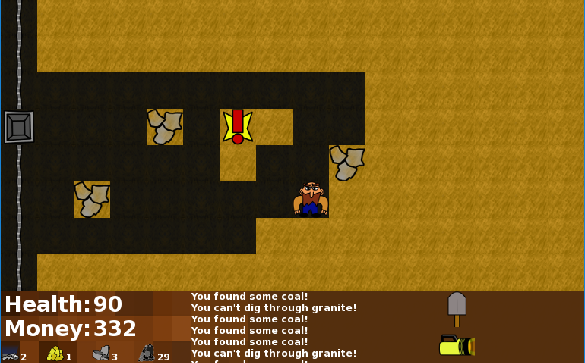

# MinerSDL
MinerSDL is a remake of Harrel W. Stiles' MinerVGA. To nobody's surprise, it's implemented using SDL and C++.

It's a simple game that involves entering the mines in order to earn enough riches to win the love of Mimi, the prettiest girl in town. (Apparently life and love was a lot more superficial in 1989.)

It was the first 'big' project that I had ever undertaken so the code might be a little scary.

